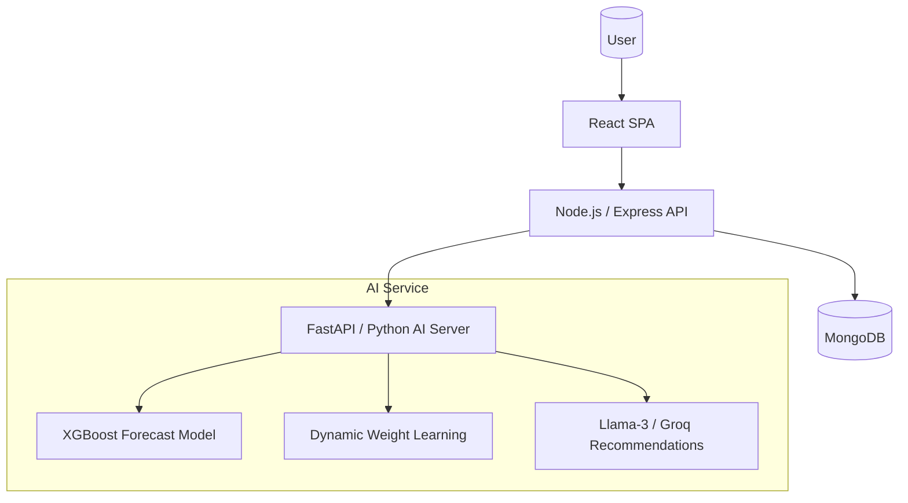

# SoulSync: Scalable Mental Health Early Intervention System

SoulSync is an AI-driven mental health ecosystem designed to bridge the gap between "feeling off" and "full-blown crisis." By combining social support, private journaling, and predictive AI, SoulSync detects subtle psychological shifts to provide early-intervention support before a crisis occurs.

## 🌟 Key Features

### 🧠 The AI Engine (Precision Support)
- **XGBoost Risk Forecasting:** Predicts user mental health trends for the next 7 days using time-series analysis.
- **Dynamic Risk Weighting:** A unique ML model that learns which factors (e.g., Sleep, Stress, or Social Interaction) are most critical for *each specific user* rather than using hardcoded rules.
- **LLM-Powered Companion:** Uses Llama-3 (via Groq) to provide context-aware, sympathetic motivational messages and concrete CBT-based coping steps.

### 📝 Therapeutic Tools
- **Sentiment-Aware Journaling:** Private journals analyzed in real-time for emotional patterns.
- **AI Mental Health Bot:** A 24/7 companion for immediate support and venting.
- **Automated CBT Reminders:** Nudges users toward grounding techniques, behavioral activation, and sleep hygiene based on detected risks.

### 👥 The Social Layer
- **Support Communities:** Engaging with peers in a safe, moderated social environment.
- **Interaction Loops:** Posting, commenting, and community support to combat isolation.
- **Engagement Gamification:** Wellness streaks and daily check-in habits.

### 📊 Deep Insights
- **Unified Dashboard:** Comprehensive visualization of wellness trends (Daily, Weekly, Monthly).
- **Early Warning Nudges:** Immediate clinical resources/helplines for users entering a High or Critical risk zone.

---

## 🏗️ Technical Architecture



### Tech Stack
- **Frontend:** React, Lucide Icons, Recharts, Vanilla CSS (Glassmorphism design).
- **Backend:** Node.js, Express, MongoDB (Mongoose).
- **AI/ML:** Python, FastAPI, XGBoost, Scikit-learn, Transformers.
- **LLM:** Groq API (Llama-3-70B).

---

## 🚀 Getting Started

### Prerequisites
- Node.js (v16+)
- Python (3.9+)
- MongoDB (Running locally or Atlas)

### Installation

1. **Clone the Repo:**
   ```bash
   git clone https://github.com/yourusername/SoulSync.git
   cd SoulSync
   ```

2. **Setup Server (Node.js):**
   ```bash
   cd server
   npm install
   # Create .env with MONGODB_URI, PORT, JWT_SECRET, PYTHON_SERVER_URL
   npm run dev
   ```

3. **Setup Python AI Server:**
   ```bash
   cd python-server
   pip install -r requirements.txt
   # Create .env with GROQ_API_KEY
   python server.py
   ```

4. **Setup Client (React):**
   ```bash
   cd client
   npm install
   npm run dev
   ```

---

## 🤖 AI Methodology

SoulSync moves beyond static scoring. Our **Dynamic Weighting System** uses an XGBoost model that analyzes historical user data to determine feature importance.

1. **Phase 1 (Training):** The system analyzes past interactions (Journals, Quizzes, Community use).
2. **Phase 2 (Weight Learning):** AI determines that for User A, "Sleep Quality" is the biggest predictor of a breakdown, while for User B, it is "Social Disengagement."
3. **Phase 3 (Active Prediction):** The Node.js server fetches these optimal weights to calculate a truly personalized Risk Score.

---

## 📅 Future Scope
- **Wearable Integration:** Real-time HRV and Sleep depth data from Apple Watch/Fitbit.
- **Voice Bio-Markers:** Detecting distress through pitch and tone in the AI Bot interactions.
- **Federated Learning:** Improving model accuracy while keeping all journal data private on the user's device.

---

## ⚖️ License
This project is licensed under the MIT License - see the LICENSE file for details.
